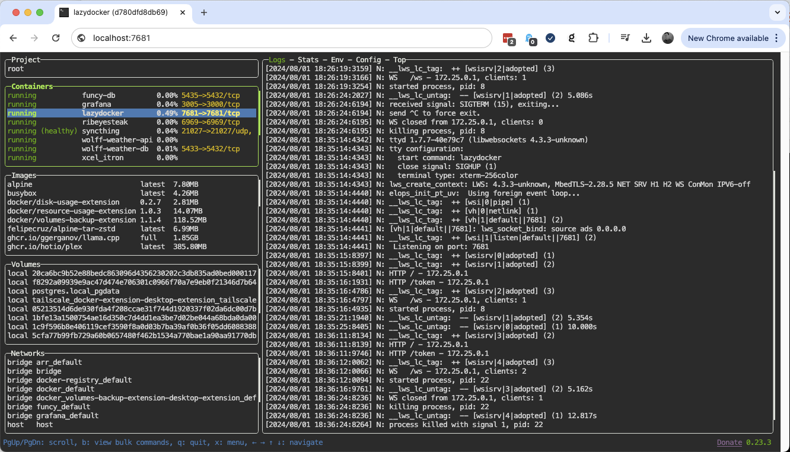

# lazydocker-web
> Run `lazydocker` in a Docker container and serve output over http using `ttyd`

## Run prebuilt image
- `docker run -it --name lazydocker --restart=always -v /var/run/docker.sock:/var/run/docker.sock -p 7681:7681 mattpowell/lazydocker-web`
- Optional (override config): add `-v ./config.yml:/root/.config/lazydocker/config.yml`

## Run locally
- `git clone https://github.com/mattpowell/lazydocker-web.git`
- `cd lazydocker-web`
- `docker compose up -d`

### NOTE:
Mounting `config.yml` is only needed if you want to override something. This repo's `Dockerfile` bakes in the checked-in `config.yml` as the default, but you can still bind-mount a different one at runtime.

The `config.yml` that's checked in to this repo contains an [override](https://github.com/mattpowell/lazydocker-web/blob/9c2b35c38dfa107c30de6d8f20e0cee9a24e7cdb/config.yml#L34) to show the last 200 lines of logs instead of showing the last 60min of logs.

## References
- [lazydocker](https://github.com/jesseduffield/lazydocker)
- [ttyd](https://github.com/tsl0922/ttyd)
